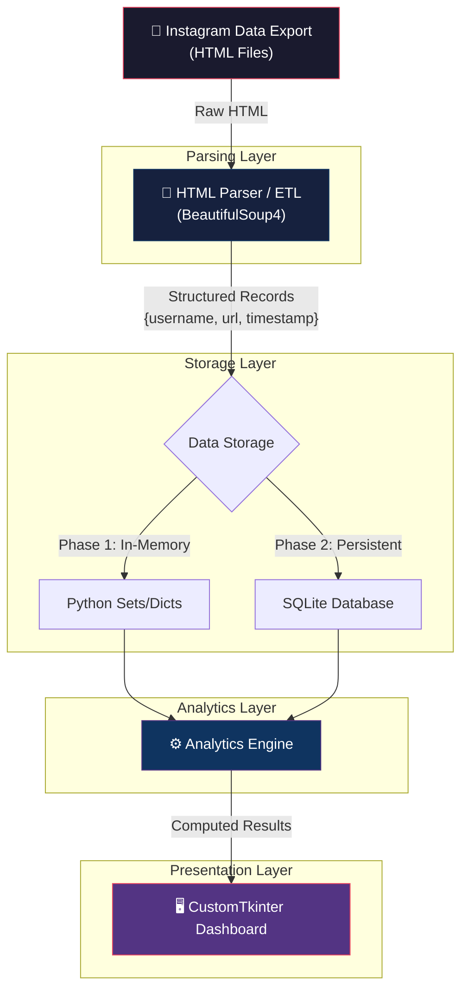
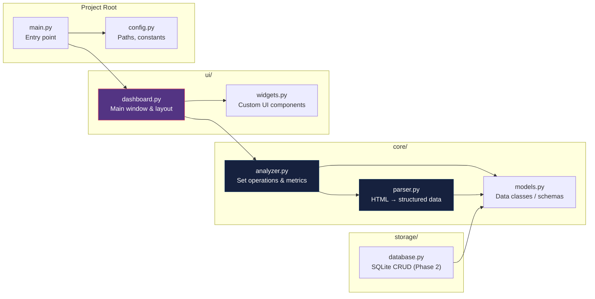

# PROJECT_MASTER.md — Instagram Analyzer

> **Version**: 0.1.0 | **Created**: 2026-04-07 | **Status**: Pre-Implementation  
> **Repository**: `https://github.com/itsmhp/instagram-analyzer`

---

## Table of Contents

1. [Project Executive Summary](#1-project-executive-summary)
2. [System Architecture](#2-system-architecture)
3. [Development Roadmap & Milestones](#3-development-roadmap--milestones)
4. [AI Assistant Operating Guidelines](#4-ai-assistant-operating-guidelines)
5. [Known Unknowns & Risks](#5-known-unknowns--risks)

---

## 1. Project Executive Summary

### 1.1 Definition

**Instagram Analyzer** is a local-only desktop application that parses static Instagram data export files and produces actionable analytics — starting with the follower/following differential ("who doesn't follow me back").

### 1.2 Primary Value Proposition

Provide a **zero-dependency, privacy-first** tool that turns Instagram's raw HTML data exports into structured, visual insights without uploading data to any external server or requiring API credentials.

### 1.3 Hard Constraints

| Constraint | Rationale |
|---|---|
| **100% local execution** | No data leaves the user's machine. No cloud, no telemetry, no external API calls at runtime. |
| **Static data parsing only** | Input is the official Instagram "Download Your Information" export. No web scraping, no unauthorized API access, no automation of Instagram's UI. |
| **No credential storage** | The application never asks for or stores Instagram login credentials. |
| **Offline-capable** | Must function without an internet connection after initial setup (dependency install). |

### 1.4 Target User

The tool's own operator — a single user analyzing their own legitimately-obtained Instagram data export.

### 1.5 Tech Stack

| Layer | Technology | Justification |
|---|---|---|
| **Language** | Python 3.10+ | Ecosystem maturity, HTML parsing libraries, rapid prototyping. |
| **HTML Parsing** | `beautifulsoup4` + `lxml` | Industry-standard for HTML scraping/parsing. Handles malformed markup. |
| **GUI Framework** | `customtkinter` | Modern-looking native desktop GUI. No web server overhead. Cross-platform. |
| **Data Persistence** (Phase 2) | SQLite via `sqlite3` (stdlib) | Zero-config embedded database. Ships with Python. |
| **Charting** (Phase 3) | `matplotlib` embedded in Tkinter | Proven integration path with Tk canvas. |
| **Packaging** (Future) | `PyInstaller` or `cx_Freeze` | Single-binary distribution for end users. |

---

## 2. System Architecture

### 2.1 High-Level Data Pipeline



### 2.2 Module Decomposition



### 2.3 Instagram Export Data Schema (Reverse-Engineered)

The official Instagram HTML export contains two distinct entry patterns. **The parser must handle both.**

#### Type A — Followers, Recently Unfollowed

Files: `followers_1.html`, `followers_2.html` ... `followers_N.html`, `recently_unfollowed_profiles.html`

```html
<div class="pam _3-95 _2ph- _a6-g uiBoxWhite noborder">
  <div class="_a6-p">
    <div>
      <div>
        <a target="_blank" href="https://www.instagram.com/{username}">{username}</a>
      </div>
      <div>{timestamp}</div>
    </div>
  </div>
</div>
```

**Extraction**: Username from `<a>` text content. URL uses `instagram.com/{username}`.

#### Type B — Following, Blocked Profiles

Files: `following.html`, `blocked_profiles.html`

```html
<div class="pam _3-95 _2ph- _a6-g uiBoxWhite noborder">
  <h2 class="_3-95 _2pim _a6-h _a6-i">{username}</h2>
  <div class="_a6-p">
    <div>
      <div>
        <a target="_blank" href="https://www.instagram.com/_u/{username}">
          https://www.instagram.com/_u/{username}
        </a>
      </div>
      <div>{timestamp}</div>
    </div>
  </div>
</div>
```

**Extraction**: Username from `<h2>` text content (preferred) or parsed from URL. Note the `/_u/` prefix in URLs — this is a redirect format.

#### Unified Record Schema

```
ProfileRecord:
  username: str          # e.g. "ozkar_fpv"
  profile_url: str       # Normalized to https://www.instagram.com/{username}
  timestamp: datetime    # e.g. "Apr 05, 2026 8:16 pm" → datetime object
  source_file: str       # Origin file for traceability
```

#### Critical: Follower File Pagination

Instagram paginates follower lists across multiple files: `followers_1.html`, `followers_2.html`, etc. The parser **must glob** for `followers_*.html` and merge results. The `following.html` file is not paginated in observed exports.

---

## 3. Development Roadmap & Milestones

### Phase 1: Core Engine — Parser + Follower/Following Diff

**Objective**: Parse the HTML export and compute the follower/following differential.  
**Output**: Working CLI/script that prints "users I follow who don't follow me back."

| Task | Description | Priority |
|---|---|---|
| **1.1** Project scaffolding | Directory structure, `requirements.txt`, entry point `main.py` | P0 |
| **1.2** HTML Parser (`core/parser.py`) | BeautifulSoup-based parser handling both Type A and Type B patterns. Glob-based multi-file ingestion for `followers_*.html`. | P0 |
| **1.3** Data Models (`core/models.py`) | `ProfileRecord` dataclass with `username`, `profile_url`, `timestamp`, `source_file` | P0 |
| **1.4** Analyzer (`core/analyzer.py`) | Set-difference algorithm: `following - followers = not_following_back`. Additional: `followers - following = fans`. | P0 |
| **1.5** Config (`config.py`) | Export folder path resolution, file pattern constants | P0 |
| **1.6** Validation | Unit tests for parser against both Type A and Type B HTML. Edge cases: empty files, malformed entries. | P1 |

**Definition of Done**: Running `python main.py --export-path ./instagram-export/` prints a numbered list of non-reciprocal follows with timestamps.

---

### Phase 2: Data Persistence & Structuring

**Objective**: Store parsed data in SQLite for historical tracking and repeated analysis without re-parsing.  
**Output**: Persistent local database with import/diff history.

| Task | Description | Priority |
|---|---|---|
| **2.1** SQLite Schema Design | Tables: `profiles`, `snapshots`, `snapshot_entries`. Normalization for multi-export comparison. | P0 |
| **2.2** Import Pipeline (`storage/database.py`) | Parse → deduplicate → upsert into SQLite. Snapshot-based: each import creates a timestamped snapshot. | P0 |
| **2.3** Diff Over Time | Compare Snapshot A vs Snapshot B: who followed/unfollowed between exports. | P1 |
| **2.4** Export Capabilities | CSV/JSON export of analysis results | P2 |

**Definition of Done**: Re-running the tool against the same export is instant (reads from DB). Importing a second export shows a diff over time.

---

### Phase 3: Dashboard UI Implementation

**Objective**: Full GUI dashboard replacing CLI output.  
**Output**: Desktop application with visual analytics.

| Task | Description | Priority |
|---|---|---|
| **3.1** Main Window Layout (`ui/dashboard.py`) | CustomTkinter window with sidebar navigation, content area, status bar. | P0 |
| **3.2** Import Wizard | File/folder picker dialog → triggers parser → progress bar → results display. | P0 |
| **3.3** Follower/Following Diff View | Tabbed/scrollable list: "Not Following Back", "Fans (follow you, you don't follow)", "Mutual". Sortable by username/date. | P0 |
| **3.4** Summary Statistics Panel | Total followers, following, ratio, blocked count, unfollowed count. Card-based layout. | P1 |
| **3.5** Charts & Visualizations | Follower/following ratio pie chart. Growth timeline (requires Phase 2 multi-snapshot data). Matplotlib embedded in Tkinter. | P2 |
| **3.6** Search & Filter | Real-time username search across all lists. Filter by date range. | P2 |
| **3.7** Packaging | PyInstaller build for Windows `.exe`. macOS `.app` bundle. | P3 |

**Definition of Done**: User launches the app, selects their Instagram export folder, and sees a complete dashboard with follower/following analysis, statistics, and charts.

---

## 4. AI Assistant Operating Guidelines

The following rules govern all future AI interactions within this workspace.

### 4.1 Context Protocol

1. **ALWAYS read `PROJECT_MASTER.md` at the start of a new conversation** before writing any code. This is the single source of truth for architecture, decisions, and constraints.
2. If `PROJECT_MASTER.md` conflicts with a user prompt, **flag the conflict** and ask for clarification before proceeding.
3. Reference section numbers (e.g., "per §2.3, Type A pattern") when justifying implementation decisions.

### 4.2 Code Quality Standards

1. **Prioritize modular code.** Every function does one thing. Every module has a single responsibility.
2. **Type hints are mandatory** on all function signatures. Use `from __future__ import annotations` where needed.
3. **No god files.** If a module exceeds ~200 lines, it needs decomposition.
4. Follow the directory structure defined in §2.2. Do not create files outside this structure without explicit approval.
5. All string literals from Instagram's HTML structure (CSS classes, URL patterns) **must be defined as constants in `config.py`**, never hardcoded inline.

### 4.3 Scope Discipline

1. **Do not over-engineer Phase 1.** No database, no GUI, no charts in Phase 1. In-memory sets. CLI output. That's it.
2. Do not add features, refactoring, or "improvements" beyond what the current phase requires.
3. Do not preemptively build abstractions for future phases. YAGNI applies ruthlessly.
4. If a task is not on the current phase's task list, it does not get implemented.

### 4.4 Dependency Management

1. **Ask for confirmation before installing any dependency** not already listed in §1.5.
2. Prefer stdlib solutions. `beautifulsoup4`, `lxml`, `customtkinter`, `matplotlib` are pre-approved.
3. Never install a package for a single convenience function. Write the utility manually.
4. Pin all versions in `requirements.txt`.

### 4.5 Data & Privacy

1. **Never commit, log, print, or transmit actual usernames** from the user's Instagram export in code examples, tests, or documentation.
2. Test data must use synthetic/fictitious usernames.
3. The raw export folder (`instagram-*/`) is always `.gitignore`d.
4. No network calls at runtime. If a feature requires network access, it must be explicitly opt-in and documented.

### 4.6 Error Handling

1. Parser errors must **not crash the application**. Log the malformed entry, skip it, report count of skipped entries at completion.
2. File-not-found errors for expected export files must produce a clear, actionable error message ("Expected file `followers_1.html` not found in export folder. Did you select the correct directory?").
3. Do not add error handling for scenarios that cannot occur. Only validate at system boundaries (file I/O, user input).

### 4.7 Version Control

1. Commit messages follow Conventional Commits: `feat:`, `fix:`, `docs:`, `refactor:`, `test:`, `chore:`.
2. One logical change per commit. Do not bundle unrelated changes.
3. Never force-push to `main` without explicit user approval.

---

## 5. Known Unknowns & Risks

### 5.1 Data Format Instability

| Risk | Severity | Mitigation |
|---|---|---|
| Instagram changes HTML export structure (CSS class names, DOM hierarchy) | **HIGH** | Parser uses loose selectors where possible. All CSS class constants centralized in `config.py` for single-point updates. Parser reports unrecognized entries rather than crashing. |
| Instagram switches export from HTML to JSON (or offers both) | **MEDIUM** | Design parser interface as abstract: `parse(file) → List[ProfileRecord]`. Swap HTML backend for JSON backend without touching analytics layer. |
| Follower pagination scheme changes (e.g., `followers_1.html` naming convention) | **MEDIUM** | Glob pattern `followers_*.html` + fallback to `followers.html` (single file). Log warning if zero follower files found. |
| Instagram introduces new data fields or removes timestamps | **LOW** | `ProfileRecord.timestamp` is `Optional[datetime]`. Parser gracefully handles missing fields. |

### 5.2 Performance & Scale

| Risk | Severity | Mitigation |
|---|---|---|
| Users with 50K+ followers produce very large HTML files (~10MB+) | **MEDIUM** | `lxml` parser (C-backed) instead of `html.parser`. Streaming parse if memory becomes an issue. Phase 2 SQLite avoids re-parsing. |
| Set operations on 50K+ entries | **LOW** | Python set operations are O(n). 50K strings is trivial for modern hardware. Not a real risk. |

### 5.3 Privacy & Security

| Risk | Severity | Mitigation |
|---|---|---|
| User accidentally commits their export data to a public repo | **HIGH** | `.gitignore` excludes `instagram-*/` pattern. README includes explicit warning. |
| Application stores parsed data in world-readable location | **MEDIUM** | SQLite DB stored in project directory (user-controlled). File permissions documented. No system-wide data storage. |
| Dependency supply-chain attack via `pip install` | **LOW** | Pin exact versions. Use `--require-hashes` for production builds. Minimal dependency surface. |

### 5.4 UX & Usability

| Risk | Severity | Mitigation |
|---|---|---|
| User selects wrong folder (not the export root) | **MEDIUM** | Validate folder structure on import: check for expected `connections/followers_and_following/` path. Provide clear error messaging. |
| CustomTkinter rendering inconsistencies across OS | **LOW** | Test on Windows primarily (primary user OS). CustomTkinter has good cross-platform support. |
| User expects real-time Instagram data (not a static snapshot) | **MEDIUM** | Clear onboarding text: "This tool analyzes your downloaded Instagram data export. It does not connect to Instagram." |

### 5.5 Technical Debt Triggers

- If Phase 1 parser becomes the de facto "production" parser without Phase 2 persistence, re-parsing on every run becomes the bottleneck for large datasets.
- Embedding `matplotlib` in Tkinter is functional but aesthetically limited. May need to evaluate alternatives (e.g., `plotly` with `webview`) in Phase 3 if chart quality is insufficient.

---

## Appendix A: File Inventory of Instagram Export

| File | Category | Description | Data Present |
|---|---|---|---|
| `followers_1.html` | Core | Follower list (paginated) | Username, URL, Timestamp |
| `following.html` | Core | Following list | Username, URL, Timestamp |
| `blocked_profiles.html` | Supplementary | Blocked accounts | Username, URL, Timestamp |
| `recently_unfollowed_profiles.html` | Supplementary | Recently unfollowed | Username, URL, Timestamp |
| `pending_follow_requests.html` | Supplementary | Outgoing pending requests | Username, URL, Timestamp |
| `recent_follow_requests.html` | Supplementary | Incoming recent requests | Username, URL, Timestamp |
| `following_hashtags.html` | Supplementary | Followed hashtags | Hashtag, URL, Timestamp |
| `custom_lists.html` | Supplementary | Custom lists (Close Friends, etc.) | List metadata |
| `profiles_you've_favorited.html` | Supplementary | Favorited profiles | Username, URL, Timestamp |
| `removed_suggestions.html` | Supplementary | Dismissed suggestions | Username, URL, Timestamp |

---

## Appendix B: Proposed Directory Structure

```
instagram-analyzer/
├── PROJECT_MASTER.md          # This document
├── README.md                  # User-facing documentation
├── requirements.txt           # Pinned dependencies
├── main.py                    # Application entry point
├── config.py                  # Constants, paths, CSS selectors
├── core/
│   ├── __init__.py
│   ├── parser.py              # HTML parsing (Type A + Type B)
│   ├── analyzer.py            # Set operations, metrics
│   └── models.py              # ProfileRecord dataclass
├── storage/
│   ├── __init__.py
│   └── database.py            # SQLite operations (Phase 2)
├── ui/
│   ├── __init__.py
│   ├── dashboard.py           # Main window layout
│   └── widgets.py             # Custom UI components
├── tests/
│   ├── __init__.py
│   ├── test_parser.py
│   └── test_analyzer.py
├── .gitignore
└── instagram-*/               # ← GITIGNORED. User's data export.
```
